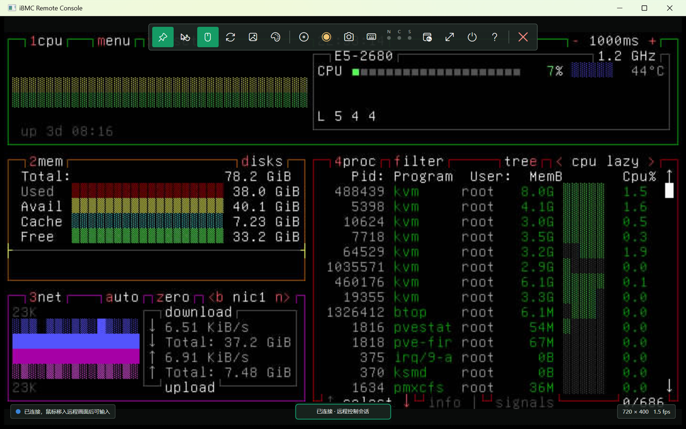
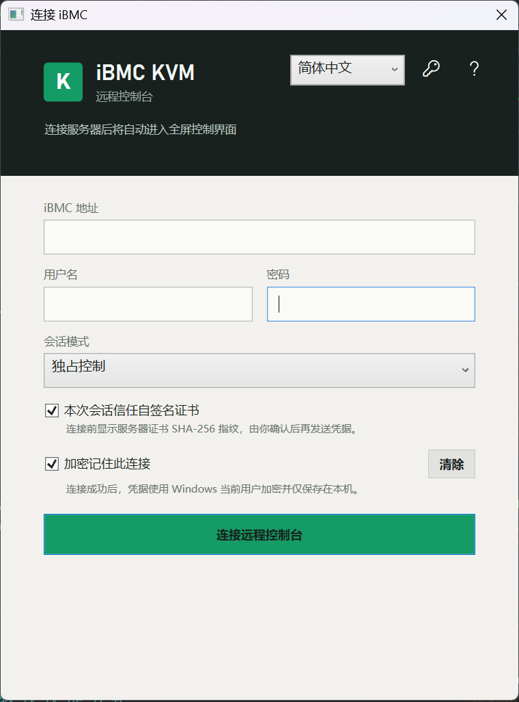
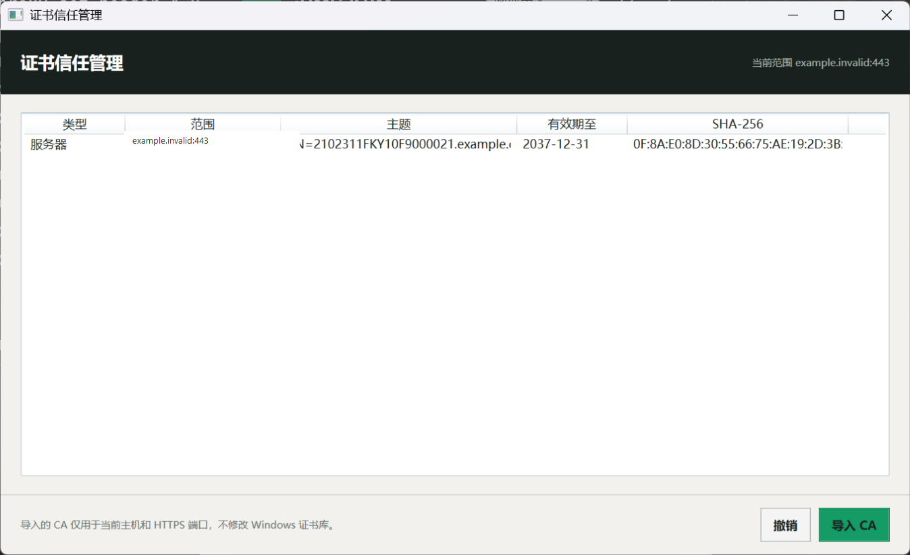
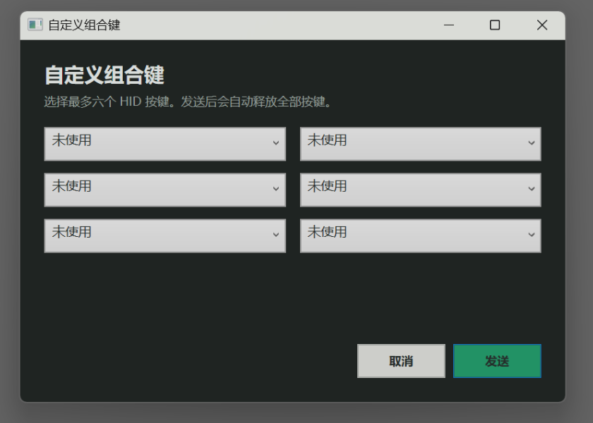
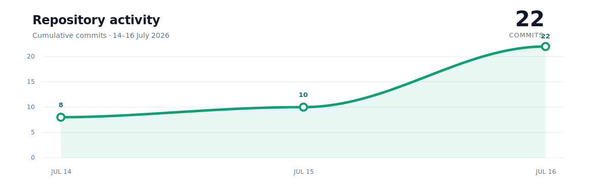

<div align="center">

<a href="https://github.com/pqcqaq/huawei-server-ibmc-kvm-control">
  
</a>

<p><strong>WINDOWS OUT-OF-BAND REMOTE CONSOLE</strong></p>

<h1>iBMC KVM</h1>

**为现代 Windows 重建的 iBMC 远程控制台**

<p>无需 Java 运行时 · 无需浏览器插件 · 不安装系统级键鼠钩子</p>

一个面向 Windows x64、以稳定输入和明确安全边界为核心的独立 KVM 客户端。

<p>
  <a href="https://github.com/pqcqaq/huawei-server-ibmc-kvm-control"></a>
  <a href="https://github.com/pqcqaq/huawei-server-ibmc-kvm-control/issues"></a>
  <a href="https://github.com/pqcqaq/huawei-server-ibmc-kvm-control/commits/master"></a>
  
  
  
  
  
</p>

<p>
  
  
  
  
  
</p>

<p>
  <a href="https://github.com/pqcqaq/huawei-server-ibmc-kvm-control">GitHub</a> ·
  <a href="https://github.com/pqcqaq/huawei-server-ibmc-kvm-control/issues">问题反馈</a> ·
  <a href="#快速开始">快速开始</a> ·
  <a href="#功能总览">功能总览</a> ·
  <a href="#系统架构">系统架构</a> ·
  <a href="#安全模型">安全模型</a> ·
  <a href="#参与贡献">参与贡献</a>
</p>

</div>



> 已连接远程控制会话示例。管理地址已经脱敏，画面不包含账户、凭据或证书信息。

iBMC KVM 是一个使用 .NET 9 与 WPF 构建的 Windows 桌面远程控制台。它把服务器视频、USB HID 键盘与鼠标、虚拟媒体、录像、断线恢复和机箱多会话管理整合到一个原生 x64 应用中，同时把输入影响范围严格限制在远端画面窗口内。

项目的目标不是为旧客户端更换一层界面，而是重新建立一套可以长期维护、可以自动测试、也能清楚解释安全边界的远程控制基础设施。

> [!IMPORTANT]
> 当前仓库以源代码构建为主要交付方式，尚未发布预编译安装包、正式版本或代码签名。请从本仓库自行构建，并在连接生产设备前核对代码来源与目标设备信息。

## 目录

- [项目起源](#项目起源)
- [设计原则](#设计原则)
- [功能总览](#功能总览)
- [界面预览](#界面预览)
- [系统架构](#系统架构)
- [安全模型](#安全模型)
- [兼容性](#兼容性)
- [快速开始](#快速开始)
- [使用指南](#使用指南)
- [构建与发布](#构建与发布)
- [测试与质量](#测试与质量)
- [项目结构](#项目结构)
- [常见问题](#常见问题)
- [参与贡献](#参与贡献)
- [许可证](#许可证)
- [项目声明](#项目声明)
- [项目演进](#项目演进)

## 项目起源

一套带外管理工具最基本的职责，是在服务器操作系统不可用时仍然可靠。历史 Java KVM 客户端却在现代 Windows 环境中暴露出一个与这项职责完全相反的问题：远程控制会话不仅可能自身卡住，还可能影响运维人员本机上的其他应用。

故障定位表明，历史客户端基于 32 位 Java 8 和 Swing，并通过 JNI 本地组件安装桌面级 `WH_KEYBOARD` 键盘钩子。其部分界面事件路径还会执行同步 TCP 写入。在 64 位 Windows 上，系统需要把特定钩子回调交回安装钩子的进程和线程；一旦消息泵或网络写入停滞，无关的 64 位 GUI 进程也可能等待该客户端，最终表现为：

- 本地键盘输入突然失效；
- 其他窗口无响应或长时间卡顿；
- KVM 窗口关闭后仍需等待系统回收异常状态；
- 不同 Java 运行时、JNI DLL 与系统位数组合产生难以复现的兼容问题。

这不是一个适合继续通过补丁叠加解决的问题。旧运行时、本地 DLL、桌面级输入钩子、全局可变状态和同步 I/O 已经把稳定性风险扩散到了远程控制台之外。于是有了 iBMC KVM：以协议行为和用户工作流为边界，使用现代 .NET 从头建立 64 位客户端。

新的实现不安装全局键盘或鼠标钩子。只有远端画面获得焦点且当前会话允许控制时，键鼠事件才会被转换为有序 USB HID 报告。登录、网络收发、视频解码、录像和虚拟媒体文件操作均在界面线程之外运行，并通过可取消的异步任务与有界队列控制资源占用。

简而言之，这个项目源于一个具体的稳定性故障，但解决的不只是一个故障：它重新定义了远程控制台应该如何隔离输入、管理协议差异、保护凭据并验证高风险操作。

## 设计原则

| 原则 | 在项目中的落实 |
| --- | --- |
| 本机稳定性优先 | 原生 x64 进程；不安装系统级键鼠钩子；不依赖 Java、浏览器插件或遗留 JNI 组件 |
| 输入必须有边界 | 仅在远端画面聚焦时发送输入；窗口失焦、切换刀片或断开连接时主动释放远端按键和鼠标按钮 |
| 网络不能阻塞界面 | 登录、传输、解码、录像和介质 I/O 使用异步任务、有界队列、取消令牌和明确超时 |
| 协议差异显式建模 | 通过能力导向的协议配置封装登录、封包、加密、输入、重连和可选命令差异 |
| 高风险操作必须可见 | 电源控制、USB 重置、证书信任和虚拟媒体写入都有权限检查、状态提示和显式确认 |
| 行为可以被验证 | Protocol、Core 与 App 分层；协议向量、状态机、输入、解码、录像和 UI 规则均可脱离真实硬件测试 |

## 功能总览

### 远程视频

- 解析 64x64 JPEG/RLE 视频块、差分帧与运行时分辨率变化；
- 支持 8、7、6、4 位颜色深度；
- 支持 DQT 图像清晰度动态调整；
- 对无视频信号、连接状态和解码异常提供明确反馈；
- 支持全屏、当前画面截图、`.rep` 录像和 Motion JPEG AVI 导出；
- 录像编码与写盘使用有界后台队列，不阻塞视频接收。

### 键盘与鼠标

- 使用有序 USB HID 键盘报告，覆盖快速输入、长按重复、按键释放与修饰键状态；
- 支持 `Caps Lock`、`Num Lock`、`Scroll Lock` 的远端状态指示；
- 支持 `Ctrl+Alt+Delete` 等常用组合键与最多六键的自定义组合；
- 提供美式、日语和法语键盘布局；
- 支持绝对、相对和捕获三种鼠标模式；
- 支持本地指针显示、远端鼠标同步与 <kbd>Esc</kbd> 释放捕获；
- 只读监视、分屏、失焦和未连接状态不会向远端发送输入。

### 会话、重连与安全

- 支持共享控制、独占控制与只读监视会话；
- 支持 HTTPS 登录、RMCP+/OEM 登录、iMana 会话以及明文或加密 KVM；
- 根据登录结果、固件能力和账户权限动态启用可用控件；
- 瞬时故障采用次数和时限均有上限的自动重连；
- KVM 恢复成功后才恢复先前挂载的虚拟媒体；
- 自签名证书需要核对 SHA-256 指纹后显式信任；
- 记住连接时，凭据使用 Windows DPAPI 按当前用户加密保存。

### 虚拟媒体

- 软驱支持镜像文件和物理驱动器，默认启用写保护；
- 光驱支持 ISO、物理光驱和本地目录；
- 本地目录会生成临时 Joliet ISO，并通过只读介质后端提供给远端；
- 软驱与光驱可以同时挂载，并支持更换、弹出和断线恢复；
- 实现 UFI 与 SFF-8020i 命令处理、介质变更状态和可选 AES-CBC 数据保护；
- 虚拟媒体使用独立连接，不与 KVM 视频接收争用同一执行路径。

### 机箱与运维操作

- 支持最多 14 个机箱槽位状态；
- 支持最多四路并发刀片会话；
- 提供刀片标签页、只读监视和 2x2 分屏；
- 交互命令始终作用于当前选中的控制会话；
- 支持开机、正常关机、重启、强制断电重启和强制关机；
- 电源命令与 USB 重置均要求显式确认，并受账户权限和会话模式约束。

### 桌面体验

- 原生 Windows x64 桌面应用，可发布为不依赖本机 .NET 安装的自包含程序；
- 图标化悬浮工具栏，按会话能力禁用不可用操作；
- 提供简体中文、English、日本語和 Français 界面；
- 内置连接、输入、录像、电源、虚拟媒体和机箱帮助；
- 证书信任、连接配置与界面偏好均可在客户端内管理。

### 能力矩阵

| 领域 | 能力 | 状态 |
| --- | --- | --- |
| 视频 | JPEG/RLE 块、差分帧、动态分辨率 | 已实现 |
| 画质 | DQT 清晰度、8/7/6/4 位颜色 | 已实现，具体选项由会话能力决定 |
| 键盘 | 有序 HID、快速输入、长按、修饰键、锁定灯 | 已实现 |
| 组合键 | 常用组合、键盘复位、自定义六键组合 | 已实现 |
| 鼠标 | 绝对、相对、捕获、本地指针、同步 | 已实现，具体模式由会话能力决定 |
| 会话 | 共享、独占、只读监视 | 已实现，是否接受由目标固件决定 |
| 恢复 | 有界自动重连、介质恢复 | 已实现 |
| 录像 | `.rep` 与 Motion JPEG AVI | 已实现 |
| 虚拟媒体 | 镜像、ISO、目录、物理驱动器 | 已实现，物理设备访问取决于 Windows 权限与驱动 |
| 机箱 | 14 槽位、四会话、标签页、2x2 分屏 | 已实现，需目标设备提供机箱能力 |
| 电源 | 开机、关机、重启及强制操作 | 已实现，需账户权限与目标设备支持 |
| 本地化 | 简体中文、英文、日文、法文 | 已实现 |

## 界面预览

本节的登录、证书与组合键截图由连接 `127.0.0.1` 的桌面冒烟测试生成，展示的是合成状态，不包含生产环境信息。README 首页使用已脱敏的真实连接会话截图。

| 安全登录 | 证书信任管理 |
| --- | --- |
|  |  |
| 会话模式、临时证书确认和 DPAPI 加密保存 | 按主机与端口管理服务器证书或导入 CA，并可随时撤销 |

<p align="center">
  
</p>

<p align="center">自定义组合键最多组合六个 HID 按键，发送完成后自动释放全部按键。</p>

## 系统架构

项目把桌面呈现、会话编排与线协议分成三个清晰层次。WPF 不解析网络包，协议层不依赖窗口对象，核心会话也不保存界面状态。

```mermaid
flowchart LR
    subgraph App[IbmcKvm.App · WPF 桌面层]
        Login[登录与证书确认]
        Console[视频画面与局部输入]
        Tools[工具栏、媒体与机箱界面]
        Settings[DPAPI 设置与信任存储]
    end

    subgraph Core[IbmcKvm.Core · 会话与工作流]
        Supervisor[会话监督与自动重连]
        Input[HID 键鼠状态机]
        Video[帧组装与颜色转换]
        Recording[REP / AVI 录像]
        Media[虚拟媒体与 SCSI 处理]
        Chassis[机箱多会话协调]
    end

    subgraph Protocol[IbmcKvm.Protocol · 协议与密码学]
        Profiles[能力导向协议配置]
        Auth[HTTPS / RMCP+ / OEM 登录]
        Transport[KVM / iMana 传输]
        Crypto[会话加密与密钥生命周期]
        VMM[VMM 封包与认证]
    end

    Device[(iBMC / iMana)]

    App --> Core
    Core --> Protocol
    Protocol -->|KVM 视频与控制| Device
    Protocol -->|独立虚拟媒体连接| Device
```



一次连接的主要数据流如下：

1. **发现与认证**：规范化管理地址，探测 HTTPS 证书，根据设备响应选择登录和协议配置。
2. **能力协商**：建立 KVM 会话并解析权限、加密、输入、虚拟媒体和机箱能力。
3. **视频接收**：协议层读取帧，核心层组装块与差分画面，应用层只负责呈现最终位图。
4. **输入发送**：WPF 聚焦事件进入 HID 状态机，状态机按顺序产生键盘或鼠标报告，再由当前协议配置编码发送。
5. **故障恢复**：会话监督器取消旧传输、按策略重建 KVM；确认视频会话恢复后，再重建已挂载介质。

进一步的设计背景见架构决策记录：

- [ADR-0001：.NET 9、WPF 与窗口局部输入](docs/adr/0001-dotnet-wpf-x64.md)
- [ADR-0002：托管 .NET 虚拟媒体栈](docs/adr/0002-managed-virtual-media-stack.md)
- [ADR-0003：能力导向的协议适配](docs/adr/0003-capability-oriented-protocol-adapters.md)

## 安全模型

远程控制台同时接触管理凭据、本地文件、键盘输入和服务器电源，因此项目把安全边界作为功能的一部分，而不是发布前的附加检查。

### 输入隔离

- 不安装全局键盘或鼠标钩子；
- 只有远端画面聚焦且会话可控制时才发送输入；
- 窗口失焦、鼠标离开、刀片切换、只读模式或断开连接会触发按键与按钮释放；
- 需要操作系统截获的组合键通过工具栏显式发送。

### 凭据与证书

- “记住此连接”默认关闭；
- 保存的连接配置写入 `%LOCALAPPDATA%\IbmcKvm\connection-settings.bin`；
- 凭据由 Windows DPAPI 加密，仅当前 Windows 用户可解密；
- 会话密钥不写入日志，也不作为设置持久化；
- 自签名证书在首次使用前展示主题、颁发者、有效期和 SHA-256 指纹；
- 证书信任按主机与 HTTPS 端口限定，可检查、导入或撤销，不修改 Windows 全局证书信任。

### 破坏性操作

电源控制、远端 USB 重置以及可写虚拟软驱可能改变服务器状态。客户端不会在连接、重连或关闭窗口时自动执行这些命令。相关入口遵循三个条件：目标会话明确、当前账户具备权限、用户完成单独确认。

### 不受信任输入

网络包、远端长度和偏移、证书、文件路径以及 SCSI 命令均按不受信任输入处理。协议读取使用边界检查；网络、解码和文件任务可取消且队列有界；临时目录镜像在会话结束时清理。

## 兼容性

项目内置多类 iBMC 与 iMana 会话配置，覆盖 HTTPS、RMCP+/OEM、不同 KVM 封包、可选加密、虚拟媒体和机箱工作流。兼容性不是一个静态的“支持/不支持”开关：同一设备系列的不同固件、账户权限和启用策略都可能改变协商结果。

| 会话类别 | 主要覆盖范围 |
| --- | --- |
| 现代 iBMC 配置 | HTTPS 登录、能力协商、KVM、输入、虚拟媒体及可选机箱能力 |
| RMCP+/OEM 配置 | RMCP+ 会话建立、OEM 命令、对应 KVM 与权限模型 |
| iMana 配置 | iMana 封包、会话材料、加密负载与相应控制能力 |

实际可用功能始终以连接时的能力协商和账户权限为准。提交兼容性问题时，请提供设备型号、固件版本、连接方式、会话模式、可复现步骤和脱敏错误信息；不要提交密码、会话密钥、证书私钥或可访问的管理地址。

## 快速开始

### 环境要求

- Windows 10 或 Windows 11 x64；
- 从源码构建需要 .NET 9 SDK；
- 使用自包含发布产物时无需预先安装 .NET 运行时；
- 目标 iBMC 网络可达，并具有相应的 KVM、虚拟媒体或电源权限。

### 从源码运行

```powershell
git clone https://github.com/pqcqaq/huawei-server-ibmc-kvm-control.git
cd huawei-server-ibmc-kvm-control
dotnet restore IbmcKvm.slnx
dotnet run --project src/IbmcKvm.App/IbmcKvm.App.csproj --configuration Release
```

启动后，输入 iBMC 主机名、IP 地址或 HTTPS 地址以及账户凭据，选择会话模式并连接。遇到自签名证书时，请先通过其他可信渠道核对 SHA-256 指纹。

## 使用指南

### 1. 建立连接

1. 输入管理地址、用户名和密码。
2. 选择共享控制、独占控制或适用的只读模式。
3. 如需保存连接，启用“加密记住此连接”；凭据只保存在当前 Windows 用户的本地配置中。
4. 自签名证书出现时，核对证书范围和指纹后再决定是否信任。

### 2. 控制远端输入

连接成功后，把鼠标移入远端画面并单击使其获得焦点。左下角状态变为“输入已启用”后，键盘和鼠标输入才会发往服务器。移出画面、切换窗口或进入只读会话会停止输入并释放远端状态。

顶部工具栏使用稳定尺寸的图标按钮提供高频操作：

| 控制 | 用途 |
| --- | --- |
| 固定 | 固定或自动隐藏悬浮工具栏 |
| 鼠标 | 切换绝对、相对或捕获模式，显示本地指针及同步远端鼠标 |
| 图像 | 调整清晰度与颜色位数 |
| 介质 | 打开虚拟软驱和虚拟光驱管理 |
| 录像与截图 | 开始或停止本地录像，保存当前帧 |
| 键盘 | 发送组合键、切换布局、复位键盘及查看锁定键状态 |
| 全屏 | 在窗口与全屏控制之间切换 |
| 电源 | 对当前控制会话执行经过确认的电源操作 |

捕获鼠标后按 <kbd>Esc</kbd> 释放。`Caps Lock`、`Num Lock` 与 `Scroll Lock` 上方指示灯表示远端反馈状态，而不是简单复制本地键盘灯。

### 3. 挂载虚拟媒体

- 软驱可选择镜像或物理驱动器，建议保持默认写保护；
- 光驱可选择 ISO、物理光驱或一个本地目录；
- 目录映射会先生成临时 Joliet ISO，大目录需要相应的本地磁盘空间；
- 关闭虚拟媒体窗口不会自动弹出介质；
- 断开控制台会关闭 VMM 会话并清理临时目录镜像；
- USB 重置可能令已挂载介质短暂断开，必须单独确认。

### 4. 录像与截图

`.rep` 保存控制台帧记录；Motion JPEG AVI 可直接由常见播放器打开。AVI 需要在收到第一帧视频后开始。录像停止、切换刀片或退出时，客户端会完成队列收尾并报告可能的丢帧数或磁盘错误。

### 5. 机箱多会话

机箱面板可以展示最多 14 个槽位的连接状态，并同时打开最多四路会话。标签页决定当前交互和命令目标；监视模式与 2x2 分屏始终只读。关闭一个刀片会话不会中断其他已连接会话。

## 构建与发布

还原依赖并执行 Release 构建：

```powershell
dotnet restore IbmcKvm.slnx
dotnet build IbmcKvm.slnx --configuration Release
```

生成 Windows x64 自包含发布目录：

```powershell
dotnet publish src/IbmcKvm.App/IbmcKvm.App.csproj `
  --configuration Release `
  --runtime win-x64 `
  --self-contained true
```

发布产物默认位于：

```text
src/IbmcKvm.App/bin/Release/net9.0-windows/win-x64/publish/
```

自包含发布会携带所需 .NET 运行时，目标 Windows 机器无需单独安装 SDK 或运行时。项目当前未提供代码签名和安装包；正式二进制版本发布后将出现在 [GitHub Releases](https://github.com/pqcqaq/huawei-server-ibmc-kvm-control/releases)。在此之前，请勿把第三方构建产物视为本项目的正式发行版。

## 测试与质量

解决方案包含 381 项自动化测试，覆盖协议、密码学、视频、输入、会话、录像、虚拟媒体、设置和 UI 规则。桌面冒烟测试只连接本机环回服务，并明确拒绝电源或 USB 重置命令。

运行全部自动化测试：

```powershell
dotnet test IbmcKvm.slnx --configuration Release
```

构建并运行 WPF 桌面冒烟测试：

```powershell
dotnet build tests/IbmcKvm.DesktopSmoke/IbmcKvm.DesktopSmoke.csproj `
  --configuration Release

./tests/IbmcKvm.DesktopSmoke/bin/Release/net9.0-windows/win-x64/IbmcKvm.DesktopSmoke.exe
```

冒烟测试生成的截图和报告位于 `.artifacts/desktop-smoke/`。该目录仅用于本地验证并已从 Git 中忽略。

测试重点包括：

- 登录响应、协议封包、CRC、RMCP+ 与加密固定向量；
- 视频块组装、RLE、颜色转换与 JPEG 解码；
- 快速输入、长按、修饰键、组合键、锁定状态与鼠标坐标；
- 重连状态机、权限规则、四会话协调与只读边界；
- UFI、SFF-8020i、目录 ISO、镜像介质和 VMM 帧；
- `.rep`、AVI、证书信任、DPAPI 设置及多语言 UI。

## 项目结构

```text
src/
  IbmcKvm.Protocol/      登录、线协议、协议配置、密码学和传输
  IbmcKvm.Core/          会话、视频、输入、录像、机箱和虚拟媒体
  IbmcKvm.App/           WPF 桌面界面、本地化、设置和证书管理
tests/
  IbmcKvm.Protocol.Tests/
  IbmcKvm.Core.Tests/
  IbmcKvm.App.Tests/
  IbmcKvm.DesktopSmoke/  仅连接本地环回服务的桌面冒烟测试
docs/
  adr/                   已采用的架构决策
  assets/                README 使用的脱敏界面截图
```

## 常见问题

**为什么只支持 Windows x64？**

项目使用 WPF、Windows DPAPI 和 Windows 物理驱动器接口，并且首要目标就是替代现代 Windows 运维环境中的旧运行时与本地组件。协议层和核心层保持独立，但当前桌面交付目标明确为 Windows x64。

**为什么连接后键盘或鼠标没有响应？**

先确认远端画面已经获得焦点，左下角显示“输入已启用”，会话不是监视或分屏只读模式，并且当前目标允许 KVM 控制。失焦时不发送输入是刻意的安全边界。

**为什么有些工具栏按钮不可用？**

按钮状态来自设备能力、会话模式和账户权限。固件不支持、登录协商未返回能力或当前账户权限不足时，相应操作会被禁用。

**自签名证书可以直接跳过吗？**

客户端允许在当前主机范围内显式信任，但不会静默忽略证书错误。首次连接应通过可信渠道核对 SHA-256 指纹。

**关闭虚拟媒体窗口会弹出 ISO 吗？**

不会。关闭窗口只隐藏管理界面，介质保持挂载；请使用弹出操作明确卸载，或断开整个控制台会话。

## 参与贡献

欢迎通过 [GitHub Issues](https://github.com/pqcqaq/huawei-server-ibmc-kvm-control/issues) 报告问题，也欢迎提交经过验证的协议兼容、稳定性、可访问性、本地化和测试改进。兼容性问题请先搜索是否已有同型号或固件版本的记录。为了让远程管理工具保持可审计，贡献应遵循以下约定：

- 从范围明确的分支提交改动，避免把无关重构混入问题修复；
- 协议、输入、密码学、虚拟媒体和权限行为变更必须附带对应测试；
- 提交前运行相关测试与 Release 构建；
- Issue、日志、抓包、夹具和截图必须完成脱敏；
- 不得提交真实凭据、密码、密钥、Token、私钥、管理地址或生产配置；
- 新设备兼容信息应包含型号、固件版本、会话方式和最小复现步骤。

对安全问题，请不要在公开 Issue 中附带可利用细节、真实目标或任何凭据。在仓库建立正式安全报告渠道之前，请通过 [GitHub Security Advisories](https://github.com/pqcqaq/huawei-server-ibmc-kvm-control/security/advisories/new) 私下联系维护者；如果该入口不可用，再提交不含漏洞细节的联系请求。

## 许可证

本仓库当前尚未包含开源许可证文件。在选择并添加明确许可证之前，源代码仍受默认著作权规则约束，不能仅因 [GitHub 仓库](https://github.com/pqcqaq/huawei-server-ibmc-kvm-control) 可见就推定为允许复制、修改或再发布。正式发布和接受外部贡献前必须先完成许可证选择。

## 项目声明

iBMC KVM 是独立开发的客户端，不隶属于设备制造商，也不代表任何设备制造商作出兼容性或支持承诺。文中出现的产品与商标名称仅用于说明兼容对象，其权利归各自权利人所有。

## 项目演进

项目以可验证的小步提交持续推进。下图按照仓库当前 Git 历史统计每日累计提交数，用于展示从协议骨架、远程输入到完整桌面体验的实现节奏；它不是下载量、设备覆盖量或兼容性认证指标。

<p align="center">
  
</p>

<p align="center"><sub>截至 2026-07-16 · 23 commits · 数据来源：当前仓库 Git 历史</sub></p>
